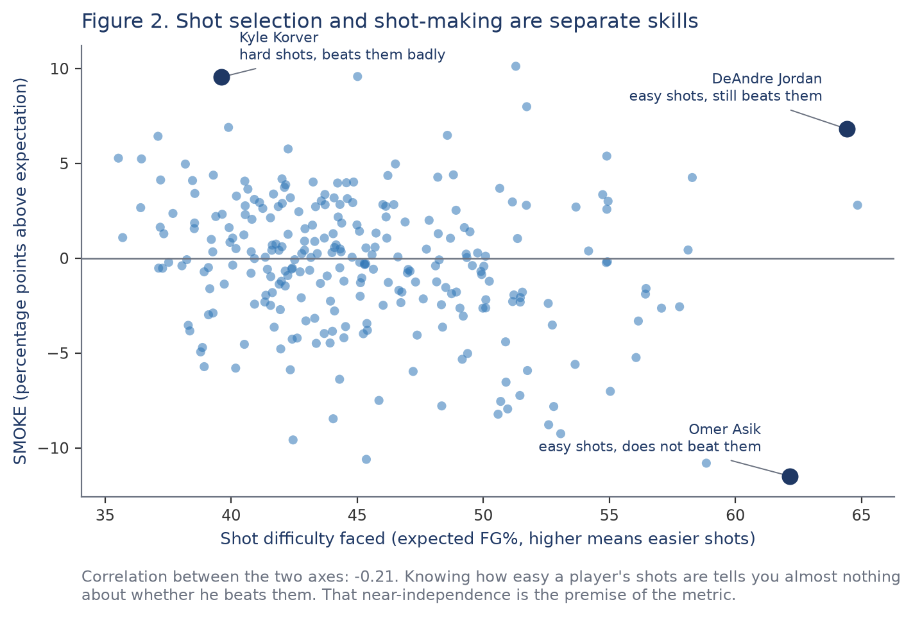
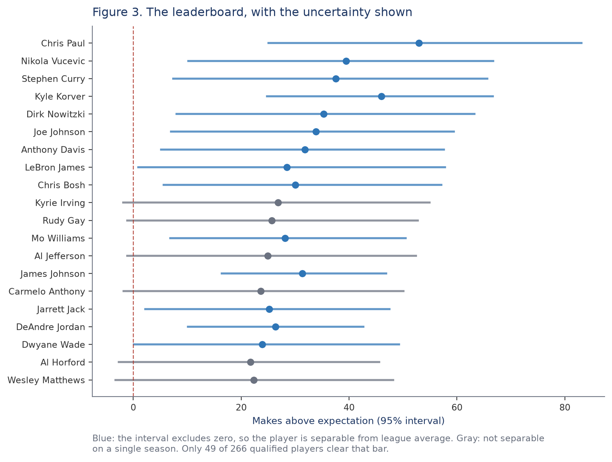
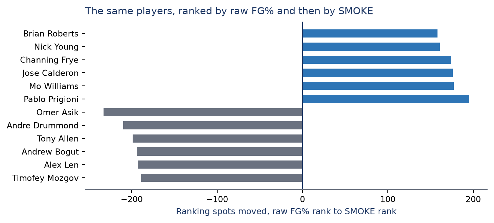

# SMOKE

**Shots Made Over Known Expectation.** Shot-making, separated from shot selection.

SMOKE is a player's actual field goal percentage minus the percentage a shot-difficulty
model expected, given where and how they shot. Positive means a player makes more shots
than the difficulty of their attempts predicts. The construction is deliberately simple.
The contribution is that every claim about the metric is tested and reproducible.

## The premise

A field goal percentage rewards two different skills at once: taking shots that are easy
to make, and making shots that are hard. They are close to independent in the data, so a
player's shot diet tells you almost nothing about whether he beats it.



## Validation summary

| Test | Result |
|---|---|
| Stability, year over year | 0.48, above effective field goal percentage (0.43) |
| Reliability, within season | 0.54 alternating shots, 0.63 first versus second half (split-half, Spearman-Brown corrected) |
| Predicts next-season shot-making | 0.40, versus 0.31 for efficiency; adds information beyond efficiency (p < 0.001) |
| Convergent validity | true shooting 0.62 down to usage 0.19 |
| Confound checks | opponent quality and venue explain 0.6% of variance; rankings correlate 0.996 after controls |
| Archetype fairness | no playing style structurally penalized (interior finishers p = 0.41); Interior Finishers are the best-measured group |

Every published value ships with a confidence interval. Only 53 of
266 qualified players separate statistically from league average within a single
season, and the leaderboard says which ones.



Full detail, method, and limitations for all eight tests: [VALIDATION.md](VALIDATION.md).
Technical writeup: [METHODS.md](METHODS.md).
Common objections, answered with the supporting figure: [FAQ.md](FAQ.md).

## Reproducing the results

1. Create a virtual environment and install dependencies:

   ```
   python -m venv .venv
   .venv/Scripts/python.exe -m pip install -r requirements.txt
   ```

2. Place the source datasets. They are free and public but not redistributed here; see
   [data/README.md](data/README.md) for sources and expected paths.

3. Build the model outputs, then the validation outputs, in order (later steps read
   what earlier ones write):

   ```
   python -m src.models.build_model_outputs
   python -m src.pulls.build_tracking_season
   # downloads the 2015-16 archive (~3.6 GB) and takes about two hours
   python -m src.validate.reliability
   python -m src.validate.stability
   python -m src.validate.convergent
   python -m src.validate.predictive
   python -m src.validate.confounds
   python -m src.validate.archetype_fairness
   python -m src.report.figures
   ```

   Outputs land in `data/v2/validation/` and should match the figures in `VALIDATION.md`;
   the figure suite is rebuilt into `artifacts/`.

4. Run the tests:

   ```
   python -m pytest
   ```

## What SMOKE sees that the box score does not

Ranking players by SMOKE instead of raw field goal percentage moves some of them a long
way. Every large move is explainable in a sentence, which is the property that makes the
metric usable rather than merely defensible.



## Dashboard

```
python -m streamlit run dashboard/app.py
```

Four pages: Player, Leaderboard, Movers, Methods. See [dashboard/README.md](dashboard/README.md).

The dashboard reads the validation outputs, so run the scripts above before starting it.
A fresh clone does not ship those files, because they are generated rather than authored.

## Limitations

SMOKE measures shot-making only. It says nothing about defense, playmaking, or rebounding, and it is one input for evaluation rather than a verdict on a player. Public per-shot difficulty data covers 2014-15 (904 of 1,230 games, Oct 28 to Mar 4, 281 shooters) and part of 2015-16 (631 games, about half a season); every load-bearing claim rests on the former. The model's expectations are cross-fitted: each shot is scored by a model that never saw its game. Most individual players are not statistically separable from average on a single season of data, which is why confidence intervals and shrinkage ship with every number.

## Credit

The paper is by **Cole Campbell**, **Marc Rajesh**, and **Calder Wyllie**. SMOKE grew out of a
DAT 490 capstone at Arizona State University built by the three of them with **Germain Meza**,
whose data engineering built the shot pipeline this work extends; within the capstone Rajesh led
the modeling and Wyllie the exploratory analysis and visualization. The post-capstone research,
validation, and writing were led by Campbell.

## License

Code and derived outputs in this repository are MIT licensed (see [LICENSE](LICENSE)). The
license covers this repository's contents only, not the underlying NBA data, which is not
redistributed here and is obtained from the public sources listed in
[data/README.md](data/README.md). See [NOTICE](NOTICE) for the full scope statement.

## Disclaimer

SMOKE is an independent analysis of publicly available NBA data. It is not affiliated with
or endorsed by the National Basketball Association.
